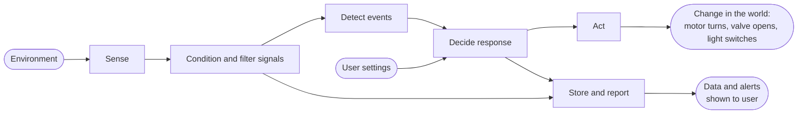
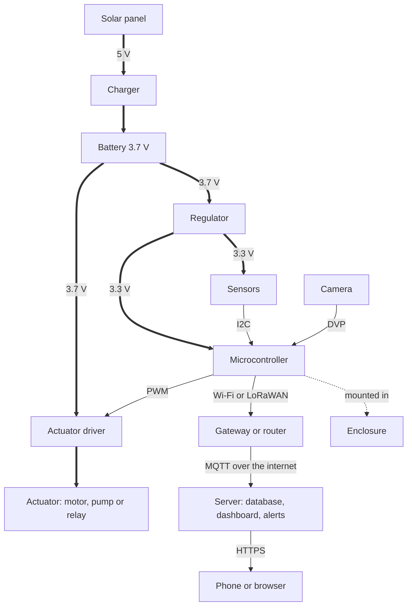
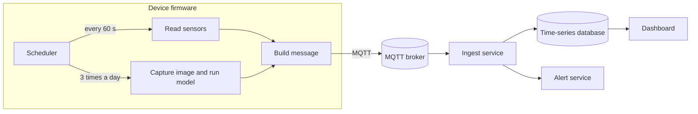
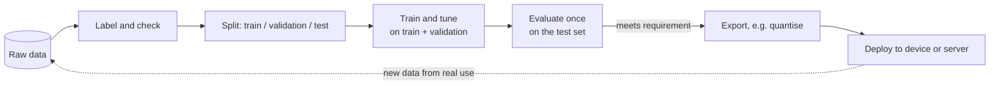
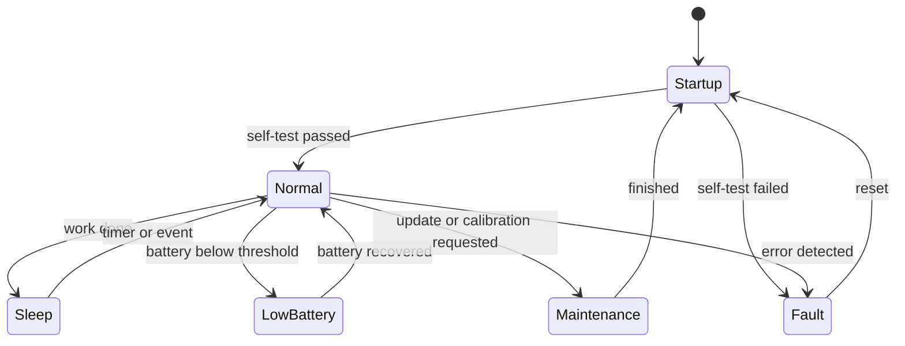

# System Architecture

<!-- GUIDE: v1 at the Phase 2 gate, then keep it up to date as the design changes.
     The diagrams below are Mermaid examples for a generic connected device: it senses,
     detects events with a model, drives an actuator and reports to a server. Replace them
     with your own system, whether that is a robot, a wearable, a sensor network or a
     software-only ML service. Rename or skip sections that don't fit, and say why.
     Mermaid reference: https://mermaid.js.org/intro/ -->

## 1. System overview

TODO: One paragraph and one photo or render of the whole system.

## 2. Functional architecture

<!-- GUIDE: What the system does, as a flow from inputs to functions to outputs. No hardware
     names here. That separation lets you change hardware without redrawing this diagram. -->

TODO: Describe each function in one or two sentences.

## 3. Physical and deployment architecture

<!-- GUIDE: The real components and how they connect: boards, sensors, actuators, power,
     networks, servers and cloud services. Use the legend consistently:
       solid arrow  -->  data / signal
       thick arrow  ==>  electrical power
       dotted arrow -.-> mechanical connection
     Software-only project: draw the deployment instead (machines, GPUs, containers, cloud
     services, where the data is stored and where the model runs). -->

**Legend:** solid = data, thick = power, dotted = mechanical.

TODO: Describe each block. Link to its subsystem document.

## 4. Interfaces

<!-- GUIDE: Every connection between subsystems. Most integration problems are interface
     problems, so pin down voltages, connectors, message formats and rates early. -->

| From | To | Type | Details |
|---|---|---|---|
| EXAMPLE: Microcontroller | EXAMPLE: Server | Data | EXAMPLE: MQTT over Wi-Fi, topic `site1/<device-id>/telemetry`, JSON `{"t": 21.4, "rh": 63, "batt": 3.91}` every 60 s |
| EXAMPLE: Battery | EXAMPLE: Regulator | Power | EXAMPLE: 3.0–4.2 V, JST-PH 2-pin, 2 A polyfuse |
| EXAMPLE: Training pipeline | EXAMPLE: Microcontroller | Data (model) | EXAMPLE: int8 TensorFlow Lite model ≤ 500 KB; input 96 × 96 RGB scaled to −1…1; output 3 class scores |
| TODO | TODO | TODO | TODO |

## 5. Software architecture

<!-- GUIDE: Processes, tasks, nodes or services; what data flows between them; and how
     often. Microcontroller: the main loop or RTOS tasks, interrupts and sleep. ROS: nodes and
     topics. IoT: devices, broker and back-end services. Python: modules and threads. -->

TODO: Describe the main loop, timing and threading. Link to the code in `src/`.

### Data and model pipeline

<!-- GUIDE: Projects with a learned model only; otherwise write "Not applicable". Show how raw
     data becomes a deployed model, and how you know which dataset version and model version
     are running where. Details go in the dataset and model cards. -->

TODO: Describe the pipeline and link the [dataset cards](../../data/README.md#datasets) and [model cards](ml-models/README.md).

## 6. Operating modes

<!-- GUIDE: The states the system can be in and what moves it between them. Robots usually
     also need Manual, Autonomous and Emergency stop states. A software service might have
     Starting, Serving, Degraded and Down. -->

| Mode | Description | How to enter | How to exit |
|---|---|---|---|
| TODO | TODO | TODO | TODO |

## 7. Failure modes and safety

<!-- GUIDE: What can go wrong while the system is running, and what it does about it. Think
     about power (flat battery, brown-outs), communication loss, sensor failure, wrong or
     uncertain model outputs, security (stolen credentials, unauthorised commands), and anything
     that moves, heats up or switches mains power. -->

| Failure | Effect | How it is detected | System response | Related requirement |
|---|---|---|---|---|
| EXAMPLE: Network link lost | EXAMPLE: Readings and alerts not delivered | EXAMPLE: No acknowledgement from the server for 3 messages | EXAMPLE: Store readings on the device and resend when the link returns; actuators go to their safe state | EXAMPLE: NFR-01 |
| EXAMPLE: Model gives a wrong or uncertain result | EXAMPLE: False alarm or missed event | EXAMPLE: Confidence below 0.7, or consecutive checks disagree | EXAMPLE: Report "uncertain"; alert only when 2 of 3 checks agree | EXAMPLE: PR-02 |
| TODO | TODO | TODO | TODO | TODO |

## 8. Revision history

| Date | Change | Related decision |
|---|---|---|
| TODO | v1 | — |
