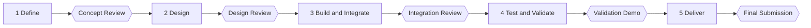

# Project Phases

Every project runs through five phases. Each phase ends with a **gate**: a review with your mentor where you show that the phase's deliverables exist and are good enough to move on.

Phases may overlap. You might start ordering parts before the Design Review, or keep refining the design during the build. The gate is a checkpoint, not a wall. **What must not happen is skipping a phase's deliverables.**

## Suggested timing

<!-- GUIDE: Your mentor may set different dates. Put the real ones in schedule.md. -->

| Phase | One-semester project (~14 weeks) | Two-semester project (~28 weeks) |
|---|---|---|
| 1. Define | Weeks 1–2 | Weeks 1–4 |
| 2. Design | Weeks 3–5 | Weeks 5–10 |
| 3. Build and Integrate | Weeks 6–10 | Weeks 11–20 |
| 4. Test and Validate | Weeks 11–12 | Weeks 21–25 |
| 5. Deliver | Weeks 13–14 | Weeks 26–28 |

## Throughout every phase

These happen continuously, not just at gates:

- [ ] Progress logs on the agreed cadence, one per person (`python tools/new.py log "<name>"`)
- [ ] Notes for every mentor meeting, and for team meetings (`python tools/new.py meeting <type>`)
- [ ] GitHub issues for tasks and bugs, kept up to date
- [ ] [Risk register](risk-register.md) reviewed at least every two weeks
- [ ] Photos and videos of progress saved to [media/](../../media/README.md). You will need them for the final report
- [ ] [Lessons learned](../08-retrospective/lessons-learned.md) added when something goes wrong or surprisingly well

## How a gate works

1. **Before the gate:** work through the phase checklist below. Run `python tools/check_docs.py --todo` and fix any broken links.
2. **Write the phase review:** `python tools/new.py review <phase-number>`. It summarises the phase, the evidence, the status against plan and the plan for the next phase.
3. **Gate meeting:** present to your mentor (10–15 minutes plus questions; slides are optional except where noted). The mentor reads the phase review and checks the deliverables.
4. **Outcome:** the mentor records one of three outcomes in the phase review:
   - **Pass:** move to the next phase.
   - **Pass with actions:** move on, but the listed actions must be closed by a set date.
   - **Not yet:** fix the gaps and hold the gate again.
5. Update the **Current phase** field in the [README](../../README.md) and close the GitHub milestone.

---

## Phase 1: Define

**Goal:** know exactly what problem you are solving, for whom, and what "done" looks like.

**Gate:** Concept Review

- [ ] [README](../../README.md): project name, one-liner, team, mentor, timeline, cadence
- [ ] [Overview](../00-project/overview.md): problem, motivation, stakeholders, use case, objectives, scope, constraints, success criteria
- [ ] [Team](../00-project/team.md): members, roles, working agreement (solo: your working plan)
- [ ] [Background research](../00-project/background.md): at least 5 relevant sources, with existing solutions compared
- [ ] [Requirements](../01-requirements/requirements.md) v1: mandatory and desirable FRs, PRs with numbers, NFRs; agreed with mentor
- [ ] [Risk register](risk-register.md): at least 5 risks, scored, each with a mitigation and an owner
- [ ] [Schedule](schedule.md): real dates for all phases and gates, and a Gantt chart
- [ ] [Budget](budget.md): available budget and initial allocation
- [ ] GitHub milestones and labels set up
- [ ] Phase 1 review written, with a short concept presentation (slides PDF linked from the review)

## Phase 2: Design

**Goal:** a design that you have reasons to believe will meet the requirements, detailed enough to start building and ordering parts.

**Gate:** Design Review

- [ ] [Concepts](../02-design/concepts.md): problem broken into functions, at least 3 concepts, selection justified
- [ ] [Trade studies](../02-design/trade-studies/README.md): at least one for each major choice (e.g. platform, main sensor, compute, connectivity, key algorithm or model)
- [ ] [Design decisions](../02-design/decisions/README.md): a DDR for every significant decision
- [ ] [Architecture](../02-design/architecture.md): functional, physical or deployment, interfaces, software (and data pipeline, if any), operating modes, failure modes
- [ ] [Subsystems](../03-subsystems/README.md): a document for each subsystem with an owner, purpose, interfaces and planned design
- [ ] [Hardware](../../hardware/README.md) (if any): BOM v1 with costs and suppliers; CAD and schematic drafts for custom parts
- [ ] Data plan (projects with a learned model): data sources and licences, labelling rules, how the test set is kept separate, and a [dataset card](../../data/README.md#datasets) started
- [ ] Long-lead parts ordered
- [ ] [Test plan](../04-testing/test-plan.md) v1: every mandatory FR and PR has a test with pass criteria
- [ ] [Traceability](../01-requirements/traceability.md): requirement → subsystem → decision → test columns filled
- [ ] Early experiments for the riskiest assumptions (at least one)
- [ ] Risk register and schedule updated
- [ ] Phase 2 review written, with a design presentation (slides PDF linked from the review)

## Phase 3: Build and Integrate

**Goal:** working subsystems, integrated into a system that performs the core function end to end, even roughly.

**Gate:** Integration Review (live or video demo)

- [ ] Each subsystem built and tested on its own, with at least one experiment per subsystem
- [ ] Each subsystem document updated: status, how to run it, interfaces, known issues
- [ ] Code in [src/](../../src/README.md) with build and run instructions; the [README](../../README.md) "Getting the code running" section works
- [ ] Hardware files (CAD, schematics, wiring diagram) match what was actually built
- [ ] Dataset and [model cards](../02-design/ml-models/README.md) up to date, with the dataset and model versions in use recorded (if any)
- [ ] BOM updated with ordered and received status and actual costs
- [ ] End-to-end demo of the core function, recorded on video
- [ ] Design changes recorded as DDRs; [architecture](../02-design/architecture.md) updated
- [ ] Test plan refined based on what you learned
- [ ] Risk register, schedule and budget updated
- [ ] Phase 3 review written, with the demo video linked

## Phase 4: Test and Validate

**Goal:** proof, with evidence, of how well the system meets each requirement.

**Gate:** Validation Demo (the final validation scenario from the test plan)

- [ ] Every test in the [test plan](../04-testing/test-plan.md) executed, with every run logged in [results.md](../04-testing/results.md)
- [ ] Requirements results summary complete, and every result linked to evidence
- [ ] Model results (if any) measured once on the untouched test set and, where possible, in real conditions
- [ ] Failed or partial requirements analysed for root cause
- [ ] [Traceability](../01-requirements/traceability.md) complete, with no gaps unexplained
- [ ] Requirement statuses updated in [requirements.md](../01-requirements/requirements.md)
- [ ] Final validation scenario rehearsed at least twice
- [ ] Validation demo recorded on video
- [ ] Phase 4 review written

## Phase 5: Deliver

**Goal:** a complete, professional submission that someone else could pick up and continue.

**Gate:** Final Submission and Presentation

- [ ] [Final report](../06-reports/final/final-report.md) complete and exported to PDF
- [ ] [Final presentation](../06-reports/final/presentation-outline.md) slides exported to PDF in `docs/06-reports/final/`
- [ ] Demo video linked from the README and the final report
- [ ] [Lessons learned](../08-retrospective/lessons-learned.md) and [future work](../08-retrospective/future-work.md) complete
- [ ] README final: photo, description, results summary, working "Getting the code running" section
- [ ] A classmate has followed the setup instructions from a fresh clone
- [ ] Team: individual contribution statements in the final report
- [ ] All issues closed or labelled as future work
- [ ] `python tools/check_docs.py --strict` passes (no broken links, no `TODO` or `EXAMPLE` left)
- [ ] Phase 5 review written, including the final retrospective
