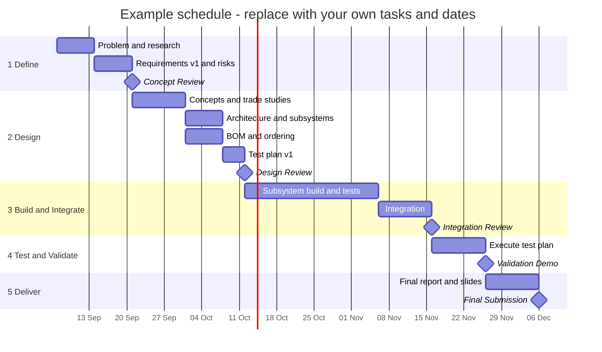

# Schedule

<!-- GUIDE: Create in Phase 1 and update at every gate and whenever a date slips.
     Keep the original planned dates and add actual dates beside them. Comparing plan with
     reality is part of what you are assessed on. -->

## Phases and gates

| Phase | Planned start | Planned gate | Actual gate | Status |
|---|---|---|---|---|
| 1. Define | TODO | TODO | | Not started |
| 2. Design | TODO | TODO | | Not started |
| 3. Build and Integrate | TODO | TODO | | Not started |
| 4. Test and Validate | TODO | TODO | | Not started |
| 5. Deliver | TODO | TODO | | Not started |

**Status values:** Not started, On track, At risk, Late, Done

## Key events

<!-- GUIDE: Presentations, demos, submission deadlines, holidays, exam periods and lab
     closures. Anything that constrains your time. -->

| Event | Date | Presenter(s) | Deliverable |
|---|---|---|---|
| TODO: e.g. Concept Review | TODO | TODO | Phase 1 review and slides |
| TODO: e.g. Final presentation | TODO | TODO | Final slides, demo |

## Gantt chart

<!-- GUIDE: Replace the example tasks and dates with your own. Keep tasks at the level of
     about one to two weeks of work. Day-to-day tasks belong in GitHub issues.
     Syntax: https://mermaid.js.org/syntax/gantt.html -->

## Schedule changes

<!-- GUIDE: Each time a planned date moves, record it. -->

| Date | What moved | From → To | Reason | Impact / recovery plan |
|---|---|---|---|---|
| TODO | TODO | TODO | TODO | TODO |
