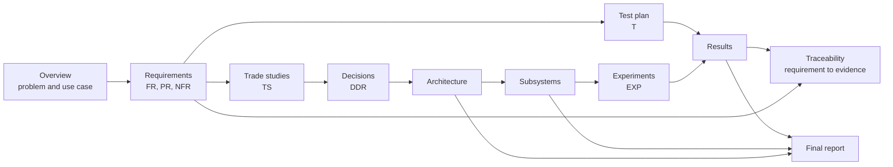

# Documentation Map

All project writing lives in `docs/`. Code is in [src/](../src/README.md), physical design files are in [hardware/](../hardware/README.md), experiment data and dataset cards are in [data/](../data/README.md), and photos and videos are in [media/](../media/README.md).

## Two kinds of document

| | Living documents | Records |
|---|---|---|
| **What** | Always describe the project **as it is now** | Capture **what happened at a point in time** |
| **When you edit them** | Whenever something changes | Once, when written. Afterwards, only fix mistakes |
| **Examples** | Requirements, architecture, subsystems, model cards, dataset cards, test plan, risk register, schedule, BOM | Progress logs, meeting notes, experiments, design decisions, trade studies, phase reviews |
| **How they are named** | Fixed names (`requirements.md`) | ID or date in the name (`EXP-2026-10-03-sleep-current.md`) |

If you are unsure whether to edit an old document or write a new one: living documents get edited, and records get a new file.

## Folders

| Folder | Contents | Living or record |
|---|---|---|
| [00-project/](00-project/) | [Overview](00-project/overview.md) (problem, use case, scope), [team](00-project/team.md), [background](00-project/background.md) research, [glossary](00-project/glossary.md) | Living |
| [01-requirements/](01-requirements/) | [Requirements](01-requirements/requirements.md) and the [traceability matrix](01-requirements/traceability.md) | Living |
| [02-design/](02-design/) | [Concepts](02-design/concepts.md), [architecture](02-design/architecture.md) and [model cards](02-design/ml-models/README.md) for any machine learning models (living); [trade studies](02-design/trade-studies/README.md) and [design decisions](02-design/decisions/README.md) (records) | Both |
| [03-subsystems/](03-subsystems/README.md) | One folder per subsystem: how it works, interfaces, status | Living |
| [04-testing/](04-testing/) | [Test plan](04-testing/test-plan.md) and [results](04-testing/results.md) (living); [experiments](04-testing/experiments/README.md) (records) | Both |
| [05-management/](05-management/) | [Phases](05-management/phases.md), [schedule](05-management/schedule.md), [risk register](05-management/risk-register.md), [budget](05-management/budget.md) | Living |
| [06-reports/](06-reports/) | [Progress logs](06-reports/progress-logs/README.md), [phase reviews](06-reports/phase-reviews/README.md), [final report and slides](06-reports/final/README.md) | Records |
| [07-meetings/](07-meetings/README.md) | Meeting notes | Records |
| [08-retrospective/](08-retrospective/) | [Lessons learned](08-retrospective/lessons-learned.md), [future work](08-retrospective/future-work.md) | Living |

## How the documents connect

By the end of the project, every mandatory requirement should be traceable to the subsystem that implements it, the decisions behind it, the test that verifies it and the evidence of the result. If you document as you go, the [final report](06-reports/final/final-report.md) is mostly a matter of assembling these pieces.

## Where to start

Follow the [phases](05-management/phases.md). Each phase lists exactly which documents must be complete before its gate.
