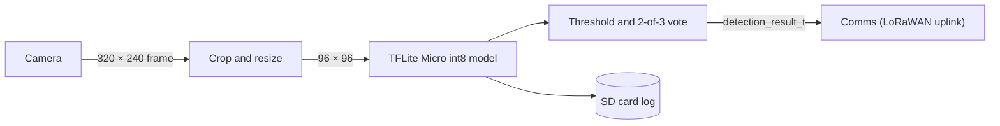

# Subsystem: Detection

> Worked example. See [examples/README.md](README.md).

- **Owner:** Mei Lin
- **Backup:** Amara Okafor
- **Status:** Testing
- **Code:** `src/firmware/components/detection/` and `src/ml/`
- **Hardware files:** `hardware/cad/enclosure/`
- **Last updated:** 2026-11-06

## 1. Purpose

Detection decides, on the node, whether the leaves in each photo show early blight, so that only a small result has to cross the LoRaWAN link. It runs at each scheduled check and passes its result to Comms.

## 2. Requirements addressed

| Requirement | How this subsystem contributes |
|---|---|
| FR-01 | Provides the early blight detection |
| PR-01, PR-02 | Model accuracy sets the system's early blight recall and precision |
| FR-D1 | Saves each check's image and result to the SD card |

## 3. Interfaces

| Direction | Connects to | Type | Details |
|---|---|---|---|
| In | Camera (OV2640) | Data | 320 × 240 RGB565 frame per check |
| In | Scheduler (`main/app_main.c`) | Data | `detection_run()` called at 08:30, 12:00 and 16:00 |
| In | Model | Data | `model_data.cc`: int8 model v3, compiled into the firmware |
| Out | Comms | Data | `detection_result_t` {class, confidence 0–255, model version}: 3 bytes of the 12-byte uplink |
| Out | SD card | Data | JPEG plus JSON sidecar for each of the last 50 checks (FR-D1) |
| Physical | Node Hardware (enclosure) | Mechanical | Camera 40 cm above the canopy, looking down at 30°, behind the anti-fog acrylic window |

## 4. Design



1. Capture a frame. The first 3 frames are discarded while auto-exposure settles, because the OV2640's first frames after power-up are dark.
2. Preprocess exactly as in training: centre crop, then bilinear resize to 96 × 96. A mismatch here once cost 6 points of accuracy.
3. Run the model, with the tensor arena in PSRAM (#15).
4. Report early blight only if it has confidence ≥ 0.70 in 2 of the last 3 checks. Otherwise, report the more likely of healthy and other. This keeps false alarms down (PR-02). The raw result of every check is still saved on the SD card.

**Design decisions:** DDR-002 (on-node inference), DDR-006 (MobileNetV2 with α 0.35 at 96 × 96 rather than a custom CNN). The model itself is described in its [model card](model-card-example.md).

## 5. Hardware

| Component | BOM ID | Notes |
|---|---|---|
| Seeed XIAO ESP32S3 Sense | E01 | OV2640 camera; 8 MB PSRAM holds the tensor arena |
| microSD card, 8 GB | E05 | Last 50 images and results (FR-D1) |
| Acrylic camera window with anti-fog coating | M03 | `hardware/cad/enclosure/` |

## 6. Software

| File | Purpose |
|---|---|
| `components/detection/detection.c` | Capture, voting and result |
| `components/detection/preprocess.c` | Crop and resize; must match training exactly |
| `components/detection/model_data.cc` | int8 model v3, generated by `src/ml/scripts/export_tflm.py` |
| `src/ml/train.py` and `src/ml/configs/mobilenetv2_96.yaml` | Model training script and its settings |

Key parameters: `ALERT_CONFIDENCE 0.70`, `ALERT_VOTES 2` (of 3) and `CAPTURE_SKIP_FRAMES 3` (in `main/config.h`).

### Run and test this subsystem on its own

```bash
cd src/firmware
idf.py set-target esp32s3
idf.py build flash monitor
# In the monitor, type t to run detection on the 20 test images on the SD card instead of the camera.

# On a laptop, from the repository root, evaluate the model on the test set
# (src/ml/README.md says where to download the dataset and the model):
cd src/ml && python evaluate.py --model models/v3/model_int8.tflite --split test
```

## 7. Verification

| Test / experiment | What it showed | Result |
|---|---|---|
| EXP-2026-10-14-int8-model-accuracy | 91.5% accuracy and 89.0% early blight recall on the greenhouse test set | Pass (PR-01 minimum) |
| EXP-2026-10-28-lighting | Recall falls to 74% on images taken at 07:00 | Limitation (see below) |
| T-01 | Scheduled 2026-11-20 | Pending |

## 8. Known issues and limitations

| Issue | Impact | Workaround | GitHub issue |
|---|---|---|---|
| Low light at 07:00 | Early blight recall falls to 74% | First check moved from 07:00 to 08:30 | #27 |
| Condensation on the window in the early morning blurs images | False "other" results | Anti-fog coating; the check is skipped and retried after 30 minutes if humidity is above 95% | #29 |

## 9. Change log

| Date | Change | By |
|---|---|---|
| 2026-10-09 | Created | Mei Lin |
| 2026-10-16 | Design updated after DDR-002 accepted | Mei Lin |
| 2026-11-06 | Added low-light limitation and humidity skip | Mei Lin |
